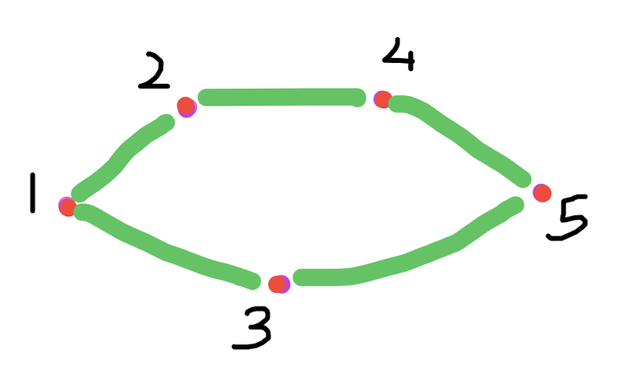

[Bilgisayar ağında en kısa mesaj yolu](https://cses.fi/problemset/task/1667)
--
Elimizde bir küme bilgisayar ve bir küme de bağlantı olsun. Her bağlantı iki bilgisayarı birbirine bağlasın. İlk bilgisayardan son bilgisayara mesajlar yollayacağız. En az sayıda bağlantı kullanmak iyi olur diyoruz. Çünkü hem daha ucuza hem de daha hızlı gider. Nasıl çözeriz [bu problemi](https://cses.fi/problemset/task/1667/)?

Çözerken kullandığımız varsayımlar şunlar:
1. Her bağlantı iki yönlü çalışıyor. Yani `b1` ve `b2` bilgisayarları arasında bir bağlantı varsa, ikisi de birbirine mesaj yollayabilir.
2. Bağlantılar arasında bir fark yok. Hepsi aynı hızla yolluyor mesajları. Ücret farkı da yok. 

Derinlemesine geziyle bulduğumuz yolların gereğinden daha uzun olabileceğini şöyle bir örnekle görebiliriz:  
.   
İlk bulduğumuz yol `1-2-4-5` olabilir ve elbette `1-3-5` yolundan uzun. Onun için enlemesine gezi algoritması kullandık: 
```c++ 
using B = unsigned; // bilgisayarların türü (kimlik numarası, ama 1'den başlıyor)
Dizi<B> *komşular; // bilgisayar ağı
Dizi<B> önceki; // yol üzerinde bir önceki bilgisayar
bool gezerek_bul(B ilk, B hedef) {
    std::queue<B> kuyruk;
    kuyruk.push(ilk);
    önceki[ilk] = ilk; // bunun öncesi yok!
    while (not kuyruk.empty()) {
        B bu = kuyruk.front();       
        kuyruk.pop();
        for(B k: komşular[bu]) {            
            if (önceki[k])
                continue;             
            önceki[k] = bu;            
            if (k == hedef) 
                return true;            
            kuyruk.push(k);       
        }
    }
    return false;
}
```
Burada `*komşular` dedim. Akıllı bir dizi `Dizi<B>` *göstergesi* (**pointer**) kullandım ve `komşular[b]` bir bilgisayar dizisi oldu. Ama önce bellekte yer ayırmak gerekli:
```c++ 
cin >> n;
komşular = new Dizi<B>[n];
``` 
Yoksa, `komşular[b]` diye yazmaya ya da okumaya kalkarsak **segmentation fault** verir. Yani belleğin yanlış bir kısmına yazma hatası. Derste *gösterge* ve temel dizi yerine akıllı dizi kullandık ama yine buna benzer bir hata yaptık. Akıllı diziyi `resize` etmeden kullandık. Neyse, şimdi algoritmaya dönelim. 

Eğer iki bilgisayar arasında bir yol yoksa, bizim `gezerek_bul` işlevimiz hedefe varamayacak ve çıktısı `false` olacak. Ama, bir arkadaşınız ne güzel sordu: yol varsa, bunun en kısa yolu bulduğunu nereden biliyoruz? 

**Olmayana ergi** kullanarak kanıtlamak belki de en kolayı. Yani bulduğumuz yolun en kısa yol olmadığını varsayalım ve bunun bir çelişkiye neden olduğunu görelim. Bir de **tümevarım**, işi iyice kolaylaştırır: Bulduğumuz yolun uzunluğu `1` olsun, yani ilk ve son bilgisayarlar komşu olsun. O zaman daha kısa yol olamaz zaten. Çünkü en kısa yolda sadece bir bağlantı var (neden? Çünkü ağda en az iki bilgisayar var (soruda `n>=2` olduğu söylenmiş) ve biz hep birinci ve sonuncu bilgisayarlar arasında mesaj yolluyoruz.) Ya en kısa yol `2` uzunluğunda olsaydı? O zaman da bir adımda ulaşan bir yol olmalıydı. Ama ilk bilgisayarın bütün komşularına baktık ve hiçbirinin hedef olmadığını gördük. Yani burda da bir çelişki var. Benzer şekilde yol uzunluğu `k` olsun. `k-1` adımda hedefe varmanın mümkün olmadığını gösterebiliriz. Tam bir kanıt olmadı ama yolu belli oldu, en azından yol göründü umarım. Görünen köy kılavuz istemez deriz ya.

Ne ilginç, bazen bir problemi çözmek, çözümün doğru olduğunu göstermekten daha kolay. Neden acaba? Ama elimizde sağlam bir kanıt olmazsa, gerçekten çözmüş sayılır mıyız? En azından kanıtın elimizde olmadığını, yani bilmediğimizi bilmekte fayda var. Bilmemek ayıp değil ya! 

Derste beraber yazdığımız [kod burada](https://onlinegdb.com/M12u-eoxi). Dersten sonra ufak tefek iyileştirmeler yaptım. [O da burada](https://onlinegdb.com/2lnD7yQ3JR). Bilhassa şu satıra dikkat: 
```c++
    onceki[1] = 1;
```
İlk bilgisayarın öncesi yok, ama bu dizideki değeri `0`'dan farklı olsun diye `1` yaptım. Görünürde bir etkisi yok gibi, ama daha doğru oldu böyle. Yoksa, ilk bilgisayarın her komşusu kuyruktan çıktığında `1`'i yine kuyruğa sokuyor, çünkü onun her komşusunun komşularından biri de kendisi! 

Yukardaki akıllı dizilerin temel dizisini kullanan [örnek kodun hepsi de burada](https://onlinegdb.com/ic_4IeiwAo). Resimdeki örneği çözüyor. Onu [derste yazdığımız kodla](https://onlinegdb.com/M12u-eoxi) karşılaştırmak faydalı olur. 

Gelecek ders için
---
Gelecek dersimizde şu [iki takım kurma problemine](https://cses.fi/problemset/task/1668) bakalım ve değişik bir ağ örneği olarak arkadaş ağlarına bakalım isterseniz. Onların üzerlerinde değişik bir gezi yapacağız.

> [StackEdit](https://stackedit.io/) ve [GitHub yazı düzenleyicisi](https://GitHub.com) kullanarak yazdım.
>
