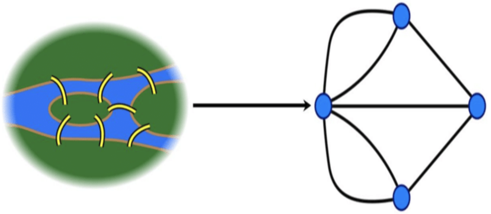

[İki takım kurmak](https://cses.fi/problemset/task/1668)
====

Bir sınıf öğrenciyi iki takıma böleceğiz. Takımlarda aynı sayıda öğrenci olması gerekmiyor.
Ama arkadaşlar farklı takımda olmalı. Yani iki öğrenci birbirleriyle arkadaşlarsa karşı takımlarda olmalarını istiyoruz.

Derste bahsetmedik ama bu soru bir çizgenin **bipartite** olup olmadığını bulmaya denk geliyor. 
Türkçe wikide *[iki parçalı graf](https://tr.wikipedia.org/wiki/%C4%B0ki_par%C3%A7al%C4%B1_graf)* demişler. 
İki parçayla kasıt bütün noktalar iki altkümeye ayrılıyor ama 
altküme içindeki noktaların arasında hiç bağ olmaması gerekiyor. 
[İngilizce wikide](https://en.wikipedia.org/wiki/Bipartite_graph) daha çok bilgi ve örnek var.

Önce gerekli türleri tanımladık:
```c++
using Arkadaş = unsigned; // Arkadaş ya da Öğrenci: 1, 2, ..., n
using Arkadaşlar = std::vector<Arkadaş>; // her öğrencinin bir arkadaş dizisi var
// bütün arkadaşlıkları temsil edecek çizgeyi tanımlamak da kolaylaştı:
std::vector<Arkadaşlar> sınıf; // örneğin sınıf[2], 2. öğrencinin bütün arkadaşlarının bulunduğu dizi
using Takım = unsigned; // 0 (henüz bir takıma dahil edilmedi), 1 ya da 2 
std::vector<Takım> takım; // takım[1]: 1. öğrencinin takımı
```
Derste vaktimiz olmadı, ama sonra ufak bir iyileştirme yaptım. `Takım` türünü biraz daha anlanmlı olsun ve `enum class` anahtar sözcüklerini de tanıyalım diye şöyle tanımladım:
```c++
enum class Takım { Yok, Bir, İki };
```
Az sayıda geçerli değeri olan türleri böyle tanımlayabiliyoruz. Aşağıdaki kodu okuyun hemen anlarsınız. Bu sadece okunurluğu arttırmakla kalmıyor, pekçok hataya de engel oluyor. Örneğin, yanlışlıkla 3. bir takım kurmaya kalksak, derleyici hemen olmaz diyor.  

İki takım kurma problemini derinleme geziyle çözebiliriz dedik ve özyineleme kullandık:
```c++
bool dgez(Arkadaş a) {
    for (Arkadaş b : sınıf[a]) // a'nın arkadaşları için
        if (takım[b] != Takım::Yok) { // bu arkadaş daha önce ziyaret edilmiş bile
            if (takım[b] == takım[a]) // bipartite değilse bu koşul doğru olacak.
                return false;  // o durumda iki takım olamaz
        } else {   // ilk hata böyle düzeldi
            using enum Takım;   // tür adını yazmak gerekmesin diye
            takım[b] = takım[a] == Bir ? İki : Bir;
            if (not dgez(b))  // a'nın arkadaşlarıyla geziye devam
                return false;
        }
    return true; // olur
}
```
Öğrendiklerimizin pekişmesi için özyineleme tekniği yerine `std::stack` kullanarak tekrar yazmanızı öneririm. Faydalı olur.
Derste `dgez(Arkadaş)` işlevini direk `main()` içinden çağırdık. Ama dersten sonra yeni bir işlev içine koydum, daha iyi oldu:
```c++
bool bul(int n) {
    for (Arkadaş a=1; a <= n; ++a) {
        if (takım[a] == Takım::Yok) { // ikinci hata da böyle düzeldi
            takım[a] = Takım::Bir;
            if (not dgez(a))
                return false;
        }
    }
    return true;
}
```
İki takım bulursak şöyle yazabiliriz:
```c++
void yaz() {
    takım.erase(takım.begin()); // ilk elemanı silelim ki yazılmasın. Öğrenciler 1'den başlıyor
    for (Takım t : takım) 
        std::cout << (t == Takım::Bir ? 1 : 2) << " ";
}
```
Yoksa olmaz diyoruz:
```c++
    if (not bul(n)) std::cout << "IMPOSSIBLE";
    else yaz();
```
Bu iyileştirilmiş kodun [hepsi testlerle birlikte burada](https://onlinegdb.com/HSBLQce38). Derste yazdığımız kodla karşılaştırmak isterseniz, o da [testleriyle birlikte burada](https://www.onlinegdb.com/LqO6HQbOQ). Başta çabucak yazdık onun için tökezledik!
Bir iki hata yaptık. Ama bence iyi oldu, **debugger**'ı kullanmaya başladık. 
*C*, *C++*, *Go* ve başka pekçok bilgisayar dilinin efsanevi yazılımı **gdb** ([GNU](https://www.gnu.org/)'nun [debugger uygulaması](https://www.sourceware.org/gdb/)) ile tanıştık. Şu hataları bulmamıza yardım etti:  
1.  `dgez()` içindeki `else` koşulu eksikti. Taban koşul olarak daha önce takıma giren bir arkadaşla karşılaşınca gezmeyi sonlandırmamız gerek. Özyinelemeli işlevlerde taban koşulu olmazsa olmaz!
2. `bul()` içindeki ilk `for` döngüsünün ilk `if` koşulu eksikti. Birinci hatada olduğu gibi, daha önce bir takıma konan bir öğrenciyi birinci takıma sokmak ve yeni bir gezi başlatmak yanlış oldu. Peki bu `for` döngüsü hiç olmasa olur mu? Çizgede en az iki *kopuk parça* varsa olmaz. Neden, anladınız değil mi?

Gelecek derste çizgeler kuramından problemler ve çizgeler üzerinde çalışan algoritmaları görmeye devam edelim mi? İsterseniz bir sonraki [gidiş dönüş problemine](https://cses.fi/problemset/task/1669) bakalım. Yönsüz çizgelerde güzel bir döngü bulmaya çalışalım. Bu arada vaktiniz olursa, [Türkçe vikiden *graf* maddesine](https://tr.wikipedia.org/wiki/Graf_(matematik)) bakıverin, olur mu? Graf (İngilizcesi graph) yerine *çizge*, düğüm (vertex) yerine *nokta* ve kenar (edge) yerine de *bağ* desek daha güzel olur mu sizce de? Belki de bir kavrama birden fazla isim takmakta da bir hayır var!

Çizgeler, matematiksel dünyadan fiziksel dünyaya dokunan, hem görsel hem de çok kullanışlı kavramlardan biri. Çizgeler kuramının tarihten bildiğimiz ilk uygulamasını merak ederseniz, [meşhur 7 köprü problemini buradan okuyabilirsiniz](https://en.wikipedia.org/wiki/Seven_Bridges_of_K%C3%B6nigsberg).     
<p align="center">
   
</p>
Sizi bilmem ama hocanız matematiğin her türünü sever: cebir, geometri, kalkülüs, bilhassa karmaşık sayıların analizi, olasılık, vb.. ama gönlünde bu çizgelerin yeri bir başka! Öte yandan sizin de matematikle arası bozuk, "matematiği iyi bilmesek ne olur" diyen tanıdıklarınız olmuştur belki. Onlara aşağıdaki resmi göstermeli. *Pi* sayısı `3` olsun, yerçekimi katsayısı *g* de `10` olsun diyenler köprü yapmaya kalksa aşağıdaki gibi olurdu herhalde! 😊   
<p align="center">
    
</p>
