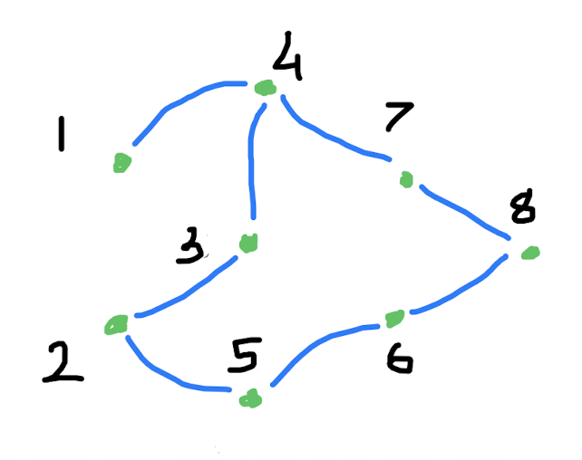

Omuzda Taşısak mı Taşımasak mı?
====

[Omuzda taşıma (*piggyback*)](https://usaco.org/index.php?page=viewproblem2&cpid=491) adlı problemi çözdük.

[Türkçesini burada okuyabilirsiniz](usaco/gumus/omuzda-tasima.md). 

Örnek girdimiz şöyle: <p align="center">
   
</p>

Beneklinin ahıra uzaklığı `uzaklık(1, 8)` olsun. En kısa yol `1->4->7->8` olduğu için, 
`uzaklık(1, 8) = 3`. O zaman tek başına ahıra dönmek için harcadığı enerji de en az `B * uzaklık(1, 8)` oluyor.
Yani `4 * 3 = 12`. Pamuk da `2->5->6->8` yolunu kullanarak `P * uzaklık(2, 8) = 4 * 3 = 12` harcar. Daha kısa yol yok. Toplam `24` oldu.
Ama `4`. otlakta buluşurlarsa, o zaman birlikte harcadıkları toplam enerji:
```
B * uzaklık(1, 4) + P * uzaklık(2, 4) + T * uzaklık(4, 8) 
    = 4*1 + 4*2 + 5*2
    = 22
```
Genelde hangi otlakta buluşmaları faydalı olur bilmiyoruz. Hatta bazı durumlarda ahıra tamamen ayrı yollardan gitmeleri bile en iyi çözüm olabilir. O durumda buluştukları otlak `N` olacak! Hatta daha da özel durumlarda `1` ya da `2` nolu otlaklardan birinde buluşmaları daha iyi olabilir. Onun için buluştukları otlağa bilinmiyor anlamına gelen `x` diyelim en iyisi (duymuş olabilirsiniz, Röntgen onun için x-ışını demiş yeni keşfine). O zaman toplam enerjiyi, `x`'in fonksiyonu olarak şöyle yazabiliriz (`f: toplam enerji`):
```
f(x) = B * uzaklık(1,x) + P * uzaklık(2,x) + T * uzaklık(x, N)
```
Buradan da birinci, ikinci ve `N` numaralı otlaklardan bütün otlaklara en kısa uzaklığı bulmamız gerektiğini görebiliyoruz. Onları bulduktan sonra, bu `f(x)`'in aldığı en küçük değeri bulmak da epey kolay:
```c++
K toplam = SONSUZ;
for(Otlak x = 1; x <= N; ++x)
    toplam = std::min(toplam, B * uz1[x] + P * uz2[x] + T * uzn[x]);
```

Bu üç uzaklık dizisini bulmak da [iki ders önce](d20260227.md) gördüğümüz `gez4()` yani enlemesine gezi kalıbıyla kolaylaşıyor. Tek fark, uzaklık dizisini girdi yapmak:
```c++
using Nokta=Otlak;
void gez(Nokta ilk, std::vector<K> & uzaklık) {
    std::queue<Nokta> kuyruk;
    kuyruk.push(ilk);
    uzaklık[ilk] = 0;
    while (not kuyruk.empty()) {
        Nokta bu = kuyruk.front();
        kuyruk.pop();
        for (Nokta şu: komşular[bu])
            if (uzaklık[şu] == SONSUZ) {
                kuyruk.push(şu);
                uzaklık[şu] = uzaklık[bu] + 1;
            }
        }
    }
}
```
Sonra da üç kere çağırmak yetiyor:
```c++
std::vector<K> uz1(N+1, SONSUZ), uz2(N+1, SONSUZ), uzn(N+1, SONSUZ);
gez(1, uz1); gez(2, uz2); gez(N, uzn);
```

Bu derse kadar genelde girdileri hep `std::cin` yani komut satırından (*console* ya da *command line*) okur,  `std::cout` ile ekrana yazardık. Onun için `#include <iostream>` kullandık hep. Bu çözüm için eskiden disk dediğimiz sabit bellekte bir dosyadan okumak ve başka bir dosyaya yazmak gerekiyor. Onun için `ifstream` (*input file*) ve `ofstream` (*output file*) türlerini kullandık:
```c++
#include <fstream>
std::ifstream girdi("piggyback.in");
girdi >> n >> m;
std::ofstream çıktı("piggyback.out");
çıktı << yanıt;
```

Derste yazdığımız kodumuz [burada](https://onlinegdb.com/DTyA3fQA0). Ben buna benzer bir kodu [USACO](https://usaco.org) sitesine girince `ç` ve `ı` gibi Türkçe harflerden ötürü hata verdi. Onun için [Türkçe harf kullanmayan kod da burada](https://onlinegdb.com/iiY93x-Fcp).

Aynı yılın diğer soruları da [bu sayfada](https://usaco.org/index.php?page=dec14results). Bronz soruların hepsini alıştırma olarak öneririm. Birincisi maraton adlı soru. [Türkçesini buradan](usaco/bronze/maraton.md) okuyabilirsiniz. İkincisi de kare bulmaca sorusu. Onun [Türkçesini de şuradan](usaco/bronze/kare-bulmaca.md) okuyabilirsiniz. Gümüş kısmında da iki soru daha var. Onlara da bakıverin isterseniz. Damlaya damlaya sıra Altın kısma da gelir. Aynı sitede epey emek verilmiş eğitim kısmı da ücretsiz olarak sizlerin emeklerinizi bekliyor. Onun [girişi de burada](https://usaco.guide/). Bunu yeni yapmışlar ve eski alıştırma sitesinin bütün soruları henüz aktarılmamış. Ona da bakmakta fayda olur. Ona [giriş de burada](https://usaco.training/). Haydi inşallah seve seve damlaya damlaya...

> [GNU Emacs](https://www.gnu.org/software/emacs) ile yazdım.
