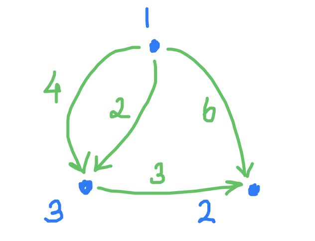
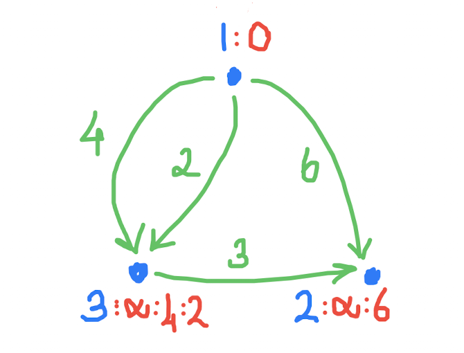
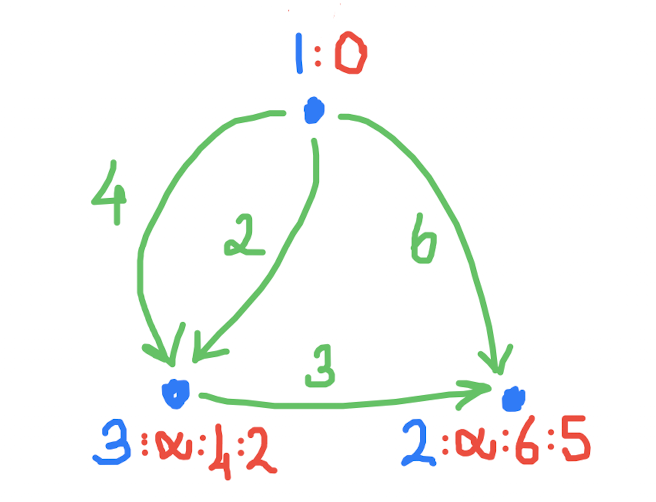

En kısa yol
===
Geçen derslerde pek çok çizge problemi gördük ve çözdük. Bir kaç tanesinde de enlemesine gezerek en kısa yolu bulduk. Bağlar bazen tek bazen de çift yönlüydü. Ama uzunlukları söz konusu olmadı. Yani hep eşit uzunlukta olduklarını varsaymıştık.

Böyle bağ uzunlukları olmayan çizgelere İngilizce'de *unweighted graph* yani *ağırlıksız çizgeler* deniyor. Ağırlık da ne demek? Uzunluk daha mantıklı olmaz mıydı? Aslında mantıklı çünkü bağların "uzunluğu" bazen gerçekten uzaklık (250 km) ya da süre (55 dakika) olur ama bazen de boru genişliği, internet bağlantı kapasitesi, ücretli yol masrafı ve aşağıdaki üçüncü soruda olduğu gibi ödül ya da ceza miktarı olabilir. 

*Weighted* yani ağırlıklı çizgelerde bağların ağırlığını ya da uzunluğunu herhangi bir sayı olarak modelliyoruz. Bazen sıfırdan küçük de olabilir. Bazen de kesirli. 

Kollarımızı sıvayıp çözmeye ve yazmaya dalabiliriz ama önce birkaç keyifli yol bulma problemiyle tanış olalım. Hepsi için ağırlıklı çizgeler kullanacağız, ama bu problemler sayesinde üç farklı algoritma göreceğiz:
1. İstanbul'dan diğer şehirlere en çabuk varan uçuş rotalarının toplam uçuş süresini nasıl bulabiliriz? [Birinci yol problemi](https://cses.fi/problemset/task/1671). Hatların süreleri farklı ama hepsi tek yönlü.
2. Bütün şehirler arasında ikişer ikişer olmak üzere en kısa yolu nasıl bulabiliriz? [İkinci yol problemi](https://cses.fi/problemset/task/1672). Yollar elbet farklı uzunlukta ama hepsi çift yönlü.
3. Birinci odadan son odaya ödüllü  tünellerden geçerek giden bir yol bulacağız. Amacımız mümkün olan en büyük ödülü almak. [Üçüncü yol problemi ](https://cses.fi/problemset/task/1673). Tüneller tek yönlü ve ödül miktarları farklı olabilir. Zaman kısıtlı değil ve geçtiğimiz tünellerden tekrar tekrar geçebiliriz! Ama bazı tüneller ödül vermiyor, ödül alıyor!

Şimdilik bu üçü yetsin ama tahmin edersiniz benzer yol ve hedef bulma problemlerinin sonu yok. Onun için bu hedefler gerçek hedefimiz değil! Uzun ince bir yoldayız. Yolda yürümenin kıymetini bilmek ve tadını çıkarmakta fayda var, değil mi?

Bu dersimizde ilk problemi çözdük. Önce örnek soruya baktık. Ne kadar sade! Şadece üç şehir ve dört tek yönlü hat var: <p align="center">
   
</p>

Hem de birinci ve üçüncü şehirler arasında iki tane hat var! Olmaz mı, olur.

Elle çözümünü tahta üzerinde yaptık. Şöyle birşey oldu:
1. İlk şehrin yanına 0 yazdık. Kendi kendine uzaklığı yok elbet. Diğer iki şehrin yanında sonsuz yazıldığını varsaydık. Yani en başta ilk şehre uzaklıkları sonsuz olsun dedik.
2. Elimize en yakın şehri aldık. 
3. Elimizdeki şehirden komşularına uzandık ve onların yanına elimizdeki şehrin yanındaki sayı artı aradaki bağın uzunluğunu yazdık. Durum şöyle oldu: <p align="center">  </p>
4. Elimize bir sonraki en yakın şehri yani `3`'ü aldık. 
5. Üçüncü adımı tekrar ettik. Yani `3`'ten komşusuna uzanarak `2`'ye vardık, ama bu sefer üçün bire uzaklığı artı aradaki bağın uzaklığı yani: `2+3=5` oldu: <p align="center">  </p>
6. Bitti.

Kod yazmaya ağırlıksız çizgelerde en az adımla hedefe varmak için kullandığımız enlemesine gezi kalıbıyla başladık. En son, [bayramdan önceki dersimizde](d20260313.md), sırtta taşıma sorusunu çözerken kullanmıştık:

```c++
using Nokta=Otlak;
void gez(Nokta ilk, std::vector<K> & uzaklık) {
    std::queue<Nokta> kuyruk;
    kuyruk.push(ilk);
    uzaklık[ilk] = 0;
    while (not kuyruk.empty()) {
        Nokta bu = kuyruk.front();
        kuyruk.pop();
        for (Nokta şu: komşular[bu])
            if (uzaklık[şu] == SONSUZ) {
                kuyruk.push(şu);
                uzaklık[şu] = uzaklık[bu] + 1;
            }
        }
    }
}
```

Ama en kısa yolu bulmak için, kuyruk yerine [öncelik sırası](https://en.wikipedia.org/wiki/Priority_queue) gerekiyor dedik. Dersten önce yolladığım [örnek kod](https://www.onlinegdb.com/ZK4g6rCHN) ve [Sadi Evren Şeker](https://en.wikipedia.org/wiki/Sadi_Evren_Seker) Hoca'nın [açıklamaları](https://bilgisayarkavramlari.com/2009/10/04/priority-queue-oncelik-sirasi-ruchan-sirasi/) da faydalı olur umarım. Ufak tefek değişikliklerle gezi kalıbımız şöyle oldu:
```c++
void gez(Şehir ilk, std::vector<U>& uzaklık) {
    öncelik_sırası<Uzaklık> sıra;
    sıra.push({0, ilk});
    uzaklık[ilk] = 0;
    while (not sıra.empty()) {
        auto [u, bu] = sıra.top();
        sıra.pop();
        if (uzaklık[bu] < u) continue;
        for (auto [süre, şu]: hatlar[bu]) {
            U yeni_u = u + süre;
            if (yeni_u < uzaklık[şu]) {
                sıra.push({yeni_u, şu});
                uzaklık[şu] = yeni_u;
            }
        }
    }
}
```

Neredeyse aynı, değil mi? `gez()`'in girdisi `Nokta` yerine `Şehir`. Ama pek önemli bir fark değil elbet. Önemli fark `std::queue` yerine `std::priority_queue` kullanması. Bu o kadar önemli ki, bunu icat eden matematikçi mühendis [Hollanda'lı Daykstra](https://tr.wikipedia.org/wiki/Edsger_Dijkstra)'nın adıyla biliniyor (Dijkstra diye yazılıyor) bu algoritma. Güzel ve çok kullanışlı. Bu öncelik sırası sayesinde, elimize aldığımız şehrin henüz işlenmemiş şehirler arasında en yakın şehir olduğundan emin oluyoruz.  

Bu arada, `priority_queue` büyükten küçüğe doğru sıralıyor. Ama bize küçükten başlayan bir öncelik sırası gerek:
```c++
template <typename Tür> using öncelik_sırası = 
std::priority_queue<Tür, std::vector<Tür>, std::greater<Tür>>;
```
Burada `std::greater<T>` *işlevcisini* (açıklama aşağıda) üçüncü tür girdisi olarak kullandık ki küçükten büyüğe sıralasın. Varsayılan tür `std::less<T>` büyükten küçüğe sıralıyordu.  

Bir de sıra kalıbının tür girdisi olarak `Uzaklık` adı verdiğimiz bir çift kullandık:
```c++
using Uzaklık = std::pair<U, Şehir>;
using Hat = Uzaklık;
```
Sıradaki her öge, ikinci değerin belirlediği şehre şu ana kadar bulduğumuz en kısa yolun uzunluğunu tutacak. Bu çift kalıbının içindeki tür girdilerinin sırası çok önemli! Çünkü öncelik sırası soldan başlayarak karşılaştırma yapıyor. Aynı şehre farklı yollardan varmak da mümkün elbet. Biz hep en yakın olanına öncelik vermek istiyoruz. Bir de benzer bir hat türü tanımladık. Çizgenin bağlarını belleğe yazmak için kullanacağız:
```c++
std::vector<std::vector<Hat>> hatlar;
// main() içinde: 
hatlar.resize(n+1);
// while döngüsü içinde:
std::cin >> kalkış >> varış >> süre;
hatlar[kalkış].push_back({süre, varış});
```

Öncelik sırasının faydası hakkında konuştuk. `std::vector` kullanıp `std::sort` ile de sıraya sokabilirdik hatları. Ama o zaman, her `push_back` (`O(1)`) sonrasında `sort` (`O(nlog(n))`) çağırmamız gerekirdi. Ama öncelik sırası `O(log(n))` ile hem ekliyor hem de sıraya sokuveriyor bizim için. Sağolsun `:-)`.  

[Dersten kodumuz burada](https://onlinegdb.com/0AjQKHV43). Dersten sonra biraz temizledim. Biraz daha [iyileşmiş haliyle kod burada](https://onlinegdb.com/18SPXZV84). [CSES.fi](https://cses.fi) sitesindeki bütün testleri geçti.  

En son da, `std::greater<T>` tür kalıbı üzerinde durduk daha iyi anlayalım diye. Tür kalıplarını epeydir kullanıyoruz ve geçen yıl kendi tür kalıplarımızı yazmıştık. İsterseniz [şuradaki notlara](../ders12.md) hızla bir bakıverin. Bu epey değişik bir tür kalıbı ki kendine özgü adı var: *functor* deniyor. *Function operator*'ın kısaltması. Türkçesi *işlevci* olsun, ne dersiniz? `priority_queue<>` tür kalıbına tür girdisi olmasının yanında, nesnesi de `sort` işlevine üçüncü girdi olarak kullanılabiliyor:

```c++
std::vector<int> dizi{3, 5, 1};
std::sort(dizi.begin(), dizi.end(), std::greater<int>());
// dizi {5, 3, 1} oldu.
```

Şöyle bir örnekle başladık: 
```c++
class Ekle {
    const int ek;
public:
    Ekle(int e=1) : ek(e) {}
    int operator()(int sayi) {
        return ek + sayi; 
    }
};
```
`Ekle` adında işlevci bir türümüz oldu. Sonra da bu türün iki nesnesini yaptık ve kullandık:
```c++
    Ekle ekle1; // 1 ekleyen işlevci
    Ekle ekle100(100); // 100 ekleyen işlevci
    int x = 5;
    // işlevci nesneler işlev gibi kullanılabiliyor:
    x = ekle1(x);   // x: 6 oldu
    x = ekle100(x); // x: 106 oldu
```

Daha detaylı bir örneği okuyup kurcalamak isterseniz, şuna bakıverin: [İşlevci Türler ve Nesneleri](https://onlinegdb.com/4AeWb8U3qu).  

Gelecek ders, başta bahsettiğimiz ikinci probleme bakar ve kısa yollar bulma serüvenimize devam ederiz inşallah. 

> [GNU Emacs](https://www.gnu.org/software/emacs), [GitHub](https://docs.github.com/en/get-started/writing-on-github/getting-started-with-writing-and-formatting-on-github/basic-writing-and-formatting-syntax#:~:text=for%20an%20exam-,Get%20started/,Styling%20text) ve [StackEdit](https://stackedit.io/) ile yazıldı.
