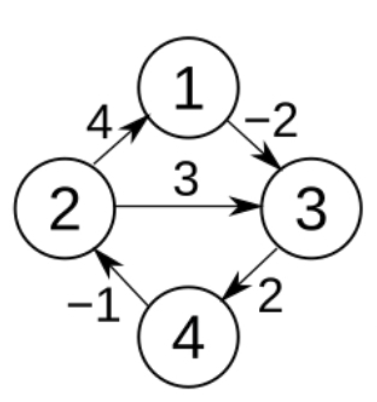

En kısa yol, 2. Bölüm
==

[Geçen dersimizde](d20260327.md) bir çıkış noktasının bütün varış noktalarına uzaklığını bulan Dijkstra algoritmasını yazdık (Daykstra diye okunuyor). Algoritma çok verimli çalışıyor demiş ama hızının tam ne olduğunu görmemiştik. 

Bu derste kısa bir analiz yaptık. Eğer `n` nokta ve `b` bağ varsa, çalışma hızının `O(b log b)` olduğunu gördük. Neden?
1. Her bağın üzerinden bir kere geçiyoruz. Onun için `O(b)`.
2. Her bağ için öncelik sırasının `push()` yöntemini kullanıyoruz. Onun çalışma hızı da `O(log b)`. Çünkü öncelikleri sıralamak için bir ağaç kullanıyor.

Ama hocam `n` hızı etkilemiyor mu diye sorabilirsiniz. Genelde etkiler elbet, ama etkisi `b`'nin etkisinden daha az. Her noktanın üzerinden en fazla bir kere geçiyoruz ve ayrıca `O(b) >= O(n)` çünkü `b ~= n^2` . Onun için `O(b log b)` makul. Ama daha da açık olsun istersek `O(n + b log b)` da diyebiliriz.

Bu dersimizde tek çıkış noktası yerine her çıkış noktası için uzaklıkları bulan Floyd-Warshall (Floyd-Uğorşal gibi söyleniyor!) algoritmasını yazdık. Biraz daha yavaş çalışıyor ama mantığı ve yazması epey kolay:

1. `f(a, b)` iki şehir arasındaki uzaklık olsun. Başta `f(a, a) = 0` ve  her `a != b` için `f(a, b) = sonsuz`.
2. `f(a, b) = f(a, o) + f(o, b)` yani iki şehir arasındaki en kısa yolu iki parçaya bölebiliriz ve ikisi de en kısa yol olmak zorunda. 
3. Yollar iki yönlü olduğu için, `f(a, b) = f(b, a)`.

```c++
    for (K o=1; o<=n; ++o)
        for (K a=1; a<=n; ++a)
            for (K b=a+1; b<=n; ++b)
                f[a][b] = f[b][a] = std::min(f[a][b], f[a][o] + f[o][b]);

```

Derste yazdığımız [kod burada](https://onlinegdb.com/KhkxfP1DDd).  

Bu algoritmayı yönlü çizgeler için yeniden yazmak faydalı bir alıştırma olur.
Hatta bir de eksi uzaklıkları da desteklemesi için gerekli değişiklikleri eklemek de iyi olur.
Şu sade örneği kullanabiliriz:<p align="center">
   
</p>
Üçüncü alıştırma da eksi sonsuza giden çevrim olup olmadığını bulmak.
Bu üç alıştırmanın [örnek bir çözümü burada](https://onlinegdb.com/9YnBMlVHq). Ama önce siz de bir kafa yorun, kodu yazmayı deneyin, olur mu?

Gelecek derste önce bu Floyd-Warshall algoritmasının neden doğru olduğunu kanıtlar, sonra da üçüncü "en kısa yol" sorusuna bakarız inşallah.   
