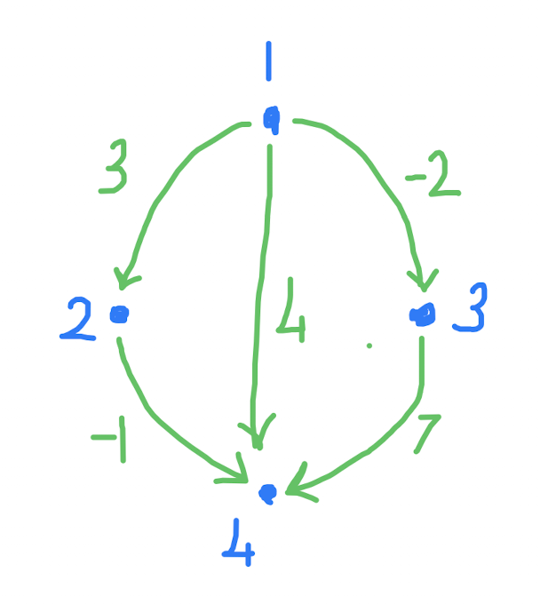

En kısa yol, 3. Bölüm
==

Önce geçen ders yazdığımız Floyd-Warshall algoritmasının neden doğru olduğunu gördük. [Kanıtımız burada](floyd-warshall.md). Sonra da şu ilginç soruya çözüm aradık: [Üçüncü yol problemi](https://cses.fi/problemset/task/1673). Birinci odadan son odaya ödüllü tünellerden geçerek giden bir yol bulacağız. Amacımız mümkün olan en büyük ödülü almak. Tüneller tek yönlü ve ödül miktarları farklı olabilir. Zaman kısıtlı değil ve geçtiğimiz tünellerden tekrar tekrar geçebiliriz! Ama bazı tüneller ödül vermiyor, ceza veriyor.  

Önce soruda verilen örnek problemin çizgesini çizdik. Dört odayı bağlayan beş tünel var: <p align="center">
   
</p>
Örneğin: Birinci odadan ikinci odaya giden tünelin ödülü 3 puan. Birinci odadan üçüncü odaya götüren tünelin cezası 2 puan.  

Mahmut arkadaşınız, Hocam, geçen iki derste gördüğümüz algoritmalardan birini kullanamaz mıyız diye güzel bir soru sordu.
İki ders önce gördüğümüz [Dijkstra algoritması](d20260327.md) çok hızlı çalışarak en iyi yolu buluyor.
Ama bu sorudaki gibi bağların uzunluğu ya da ağırlığı bazen eksi sayılar olursa, doğru yanıtı vermiyor (neden?) Aç gözlü diye bilinen algoritmalardan biri olduğu için ama güzel bir karşıt örnekle kendimizi ikna etmemiz iyi olur.  

Öte yandan geçen dersteki [Floyd-Warshall](d20260403.md), hem eksi sayıları, hem de sonsuza kadar artan (ya da azalan) çevrimleri destekliyor. Ama bir çıkış noktasıdan değil her hangi bir çıkış noktası için bütün varış noktalarına uzaklığı buluyor. Onun için de, iç içe üç döngü kullanıyor.
Dolayısıyla `n`'nin küpüyle artıyor çalışma süresi. Nokta sayısı `n` çok yüksek olunca da çok zaman alıyor.  

Bugünkü problemimizi çözmek için icat edilmiş algoritmanın adı Bellman-Ford. Çok faydalı ve kullanışlı bir yöntem. Floyd-Warshall'a da epey benziyor: `f(a)` birinci odadan `a` odasına vardığımızda aldığımız toplam ödül olsun:
1. Başlangıçta her oda için `f(a) = -sonsuz` olsun diyoruz, yani başta sonsuz cezayla başlıyoruz. Ama `f(1) = 0` olacak. Birinci odaya varmak için ne ödül ne de ceza var:
```c++
std::vector<S> f(n+1, -SONSUZ);
f[1] = 0;
```
2. İki oda `a` ve `b` arasında `x(a,b)` ödüllü bir tünel varsa, `f(b) = f(a) + x(a,b)` olur. Birinci odadan son odaya varmak için en fazla kaç tünelden geçmek gerekebilir? Tek sıralı bir örnek düşünelim: `1->2->3->4` olsun. O zaman `3` tünelden geçiyoruz. Yani `n-1` tünel yetecek. Onun için dış döngü `n-1` kere çalışsın ve içinde de `f(a) = f(b) + x(a,b)` eşitliğini kullanarak ödül miktarını güncelleyelim:
```c++
for (K k = 1; k < n; ++k)
    for (auto [a, b, x] : tüneller)
        f[b] = std::max(f[b], f[a] + x);
```
3. Bu noktada her varış noktası için ödül değerini bulmuş oluyoruz! Neden? Kanıtı gelecek derse kaldı. Ama ya sonsuza kadar artan bir çevrim varsa? İşin güzel tarafı, bütün tünellerin üzerinden bir kere daha geçip aynı eşitliği kullanarak artan çevrimleri de bulabiliyoruz. 
```c++
Odalar çevrim; // varsa, artan çevrim üzerindeki odaları buna koyalım 
for (auto [o1, o2, x] : t)
    if (skor[o1] + x > skor[o2]) 
        çevrim.push_back(o2);
```
4. Eğer artan çevrim üzerindeki odalar arasında birinci ya da sonuncu oda varsa, sonsuz ödül kazanabiliriz:
```c++
for (Oda o : çevrim) 
    if (o == 1 or o == n)
        // sonsuz!
```
5. Ama belki de bu artan çevrime birinci odadan ulaşmak mümkün olmayabilir. Ya da artan çevrimden son odaya gitmek için bir yol olmayabilir. O zaman da ikinci adımda bulduğumuz ödül doğru olmalı:
```c++
for (Oda o : çevrim) 
    if (yol(1,o) and yol(o,n)) 
        // sonsuz!
```
Burada `yol(a,b)` işlevi, artık çok iyi bildiğimiz derinlemesine gezi kalıbını kullanarak `a` odasından `b` odasına varıp varamayacağımızı buluyor. 

Hepsini bir araya koyalım:
```c++
using K = unsigned; using Oda = K; K n;
using S = long long; const S SONSUZ = 1e18;
#include <vector>
using Odalar = std::vector<Oda>;
using Tünel = std::tuple<Oda, Oda, S>;
using Tüneller = std::vector<Tünel>;
#include "yol.hpp"
#include <iostream>
int main() {
    K m;
    std::cin >> n >> m;
    Tüneller tüneller;
    while(m-- > 0) {
        Oda o1, o2; S x;
        std::cin >> o1 >> o2 >> x;
        tüneller.push_back({o1, o2, x});
    }
    std::vector<S> skor(n+1, -SONSUZ);
    skor[1] = 0;
    for (K k = 1; k < n; ++k)
        for (auto [o1, o2, x] : tüneller)
            skor[o2] = std::max(skor[o2], skor[o1]+x);
    Odalar çevrim; // varsa, artan çevrim üzerindeki odalar
    for (auto [o1, o2, x] : tüneller)
        if (skor[o1] + x > skor[o2]) 
            çevrim.push_back(o2);
    if (yol(çevrim, tüneller)) std::cout << -1;
    else std::cout << skor[n];
    return 0;
}
```

Derinlemesine gezi kısmını `yol.hpp` adında bir dosyaya koydum ki daha okunuşlu olsun:
```c++
std::vector<Odalar> komşular;
using BD = std::vector<bool>;
void gez(Oda bu, BD & gezildi) {
    if (gezildi[bu]) return;
    gezildi[bu] = true;
    for(Oda şu : komşular[bu])
        gez(şu, gezildi);
    return;
}
bool yol(Oda a, Oda b) { // a'dan b'ye gidilebilir mi?
    BD gezildi(n);
    gez(a, gezildi);
    return gezildi[b];
}
bool yol(const Odalar& çevrim, const Tüneller& tüneller) {
    for (Oda o : çevrim) 
        if (o == 1 or o == n) 
            return true;
    komşular.resize(n+1);
    for(auto [o1, o2, x] : tüneller)
        komşular[o1].push_back(o2);
    for (Oda o : çevrim) 
        if (yol(1,o) and yol(o,n)) 
            return true;
    return false;
}
```

Kodumuzun [hepsi burada](https://onlinegdb.com/BMoWHgaP3). [CSES](https://cses.fi) sitesine girip tam doğrulamak iyi olur. Ama önce `yol.hpp` dosyasını kesip `#include "yol.hpp"` satırı üstüne yapıştırın. 

